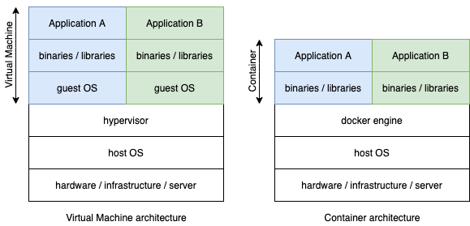

# **Container vs Virtual Machine**

    

 

Containers are often compared to Virtual Machines, but they aren't  
 * Containers are processes running on a host  
 * They have limited resources like CPU, memory
 * Containers exit when the process stops